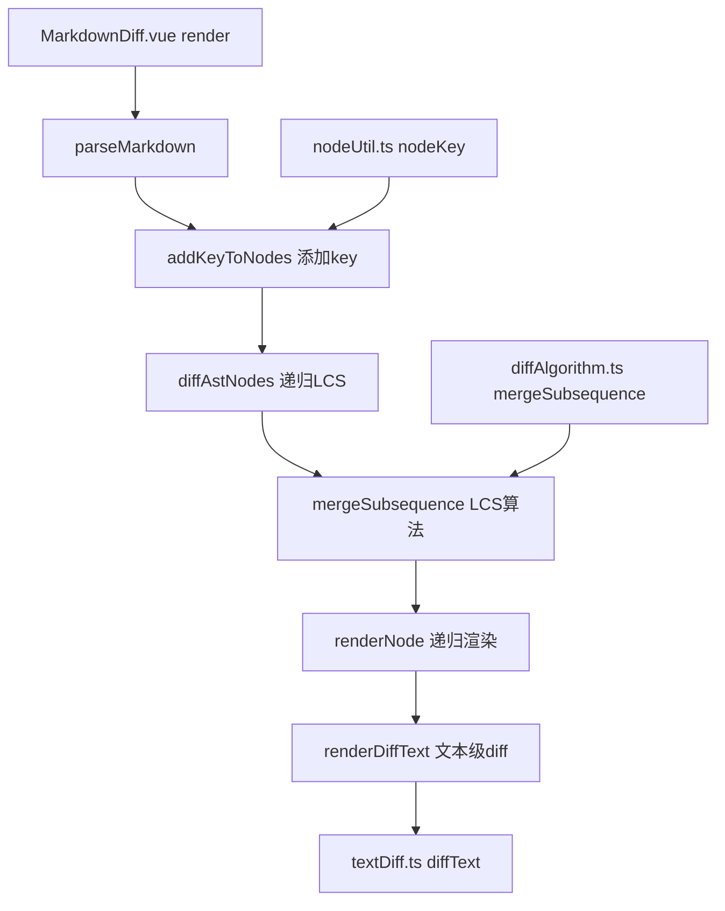

## 产品概述

优化 MarkdownDiff 组件的 AST 节点差异比较算法，使用 LCS（最长公共子序列）算法替代当前的简单索引比较，提高 diff 准确性。

## 核心功能

- 优化 `nodeKey()` 生成策略，根据节点类型添加区分属性（heading.depth、link.url、code.lang 等），减少 key 冲突
- 为 AST 节点添加 `key` 属性，使其兼容 LCS 算法
- 使用 LCS 算法进行 AST 节点匹配（替代按索引比较）
- 递归处理所有层级的 children，实现深度差异比较
- 使用 `textDiff.ts` 的 `diffText()` 函数进行文本级 diff（替代直接在组件中引用 diff-match-patch）
- 保持 equal 节点的文本级 diff 功能

## 技术栈选择

- 前端框架: Vue 3 (Options API with render function)
- 类型系统: TypeScript
- AST 解析: remark + remarkGfm
- Diff 算法: 自定义 LCS 实现 (diffAlgorithm.ts)
- 文本 Diff: diff-match-patch (通过 textDiff.ts 封装)

## 实现方案

### 1. 优化 nodeKey() 生成策略

**文件**: `src/diff/nodeUtil.ts`

**当前问题**:

- `fingerprint()` 只取前 30 字符，容易产生冲突
- 未利用节点的区分属性（heading.depth, link.url 等）
- 空/无文本节点的 key 相同

**修改内容**:

- 修改 `fingerprint()` 函数，增加可选参数 `maxLength`，默认 100
- 修改 `nodeKey()` 函数，根据节点类型添加区分属性：
- `heading`: 添加 `depth` 属性
- `link`: 添加 `url` 属性
- `image`: 添加 `url` 和 `alt` 属性
- `code`: 添加 `lang` 和 `meta` 属性
- `inlineCode`: 添加 `value` 前 50 字符
- 空节点使用 `__empty__` 标识

### 2. 添加 addKeyToNodes() 函数

**文件**: `src/diff/nodeUtil.ts`

**问题**: `diffAlgorithm.ts` 的 `mergeSubsequence()` 要求 `<T extends { key: string }>`，但 remark AST 节点没有 `key` 属性。

**解决方案**: 添加 `addKeyToNodes()` 函数，递归为 AST 节点添加 key 属性：

```typescript
export function addKeyToNodes(nodes: any[]): any[] {
  if (!nodes || !Array.isArray(nodes)) return []
  
  return nodes.map(node => {
    if (!node || typeof node !== 'object') return node
    
    const newNode = { ...node, key: nodeKey(node) }
    
    if (newNode.children && Array.isArray(newNode.children)) {
      newNode.children = addKeyToNodes(newNode.children)
    }
    
    return newNode
  })
}
```

### 3. 修改 MarkdownDiff.vue 使用 LCS 算法

**文件**: `src/components/MarkdownDiff.vue`

#### 3.1 引入依赖

- 移除 `diff_match_patch` 直接引用
- 引入 `mergeSubsequence` 和 `DiffNode` 类型 from `../diff/diffAlgorithm`
- 引入 `addKeyToNodes` from `../diff/nodeUtil`
- 引入 `diffText` from `../diff/textDiff`

#### 3.2 使用 textDiff.ts 进行文本差异计算

替换原有的 `renderDiffText()` 函数，使用 `diffText()` 替代直接调用 diff-match-patch：

- 移除 `tokenizeText()` 函数（不再需要分词）
- 修改 `renderDiffText()` 直接使用 `diffText(oldText, newText)` 的结果
- 利用 `diff_cleanupSemantic()` 优化后的 diff 结果直接渲染

#### 3.3 实现递归 LCS Diff

新增 `diffAstNodes()` 函数，递归使用 LCS 算法比较两个 AST 节点数组：

- 调用 `mergeSubsequence(oldNodes, newNodes)` 获取 LCS 结果
- 对于 `equal` 类型的节点，递归处理其 children
- 对于 `insert`/`delete` 类型的节点，标记 diffType

#### 3.4 修改 renderNode() 处理新的 DiffType

修改 `renderNode()` 函数，使其能处理 LCS 算法生成的 `equal/insert/delete` DiffType：

- 从 `node.__data.diffType` 获取差异类型
- 对于 `equal` 节点且包含 `__data.node` 的情况，使用 `oldNode` 和 `newNode` 的文本内容做 diff
- 对于 `insert`/`delete` 节点，添加相应的 HTML 标签（`ins`/`del`）

#### 3.5 修改渲染逻辑

修改 `render()` 函数中的主流程：

- 为新旧 AST 的 children 添加 key（调用 `addKeyToNodes()`）
- 使用 `diffAstNodes()` 替代 `mergeAstNodes()`
- 根据 `node.__data.diffType` 添加块级差异样式

### 4. DiffType 映射

| diffAlgorithm.ts | MarkdownDiff.vue | 渲染方式 |
| --- | --- | --- |
| `'equal'` | 无 diffType | 正常渲染，子节点做文本级 diff |
| `'insert'` | `'add'` | 绿色背景 + 左侧绿色边框 |
| `'delete'` | `'remove'` | 红色背景 + 左侧红色边框 |


### 5. 边界情况处理

1. **空节点**: fingerprint 返回空字符串时，使用 `'__empty__'` 标识
2. **无 children 的节点**: 不进行递归 diff
3. **key 冲突**: 即使 key 相同，LCS 也会将其标记为 equal，然后通过文本级 diff 显示细微差异
4. **大文档性能**: LCS 算法时间复杂度 O(m×n)，对于非常大的文档可能需要优化

## 架构设计

### 系统架构



### 数据流

```
oldMarkdown/newMarkdown
    ↓
parseMarkdown() → AST (remark)
    ↓
addKeyToNodes() → 递归添加 key 属性
    ↓
diffAstNodes() → 递归 LCS 计算差异
    ↓
mergeSubsequence() → LCS 算法匹配
    ↓
renderNode() → 递归渲染 (使用 LCS 结果)
    ↓
    ├─ equal 节点 → 正常渲染 + 子节点递归 diff + 文本级 diff
    ├─ insert 节点 → 标记为 add + 绿色边框
    └─ delete 节点 → 标记为 remove + 红色边框
    ↓
renderDiffText() → 文本级差异高亮 (使用 textDiff.ts)
```

## 目录结构

```
c:/code/markdown-diff/
├── src/
│   ├── diff/
│   │   ├── diffAlgorithm.ts  # [KEEP] 保持不变
│   │   ├── nodeUtil.ts       # [MODIFY] 优化 nodeKey() + 添加 addKeyToNodes()
│   │   └── textDiff.ts       # [KEEP] 保持不变
│   ├── utils/
│   │   ├── markdownParser.ts # [KEEP] 保持不变
│   │   └── textDiff.ts       # [CHECK] 检查是否为重复文件，如果是则删除
│   └── components/
│       └── MarkdownDiff.vue  # [MODIFY] 使用 LCS 算法 + 递归处理 + 使用 textDiff.ts
```