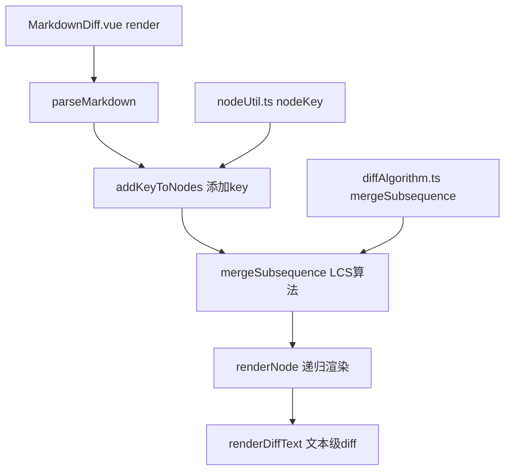

## 产品概述

优化 MarkdownDiff 组件的 AST 节点差异比较算法，使用 LCS（最长公共子序列）算法替代当前的简单索引比较，提高 diff 准确性。

## 核心功能

- 优化 `nodeKey()` 生成策略，根据节点类型添加区分属性，减少 key 冲突
- 为 AST 节点添加 `key` 属性，使其兼容 LCS 算法
- 使用 LCS 算法进行 AST 节点匹配（替代按索引比较）
- 递归处理所有层级的 children，实现深度差异比较
- 保持 equal 节点的文本级 diff 功能

## 技术栈

- 前端框架: Vue 3 (Options API with render function)
- 类型系统: TypeScript
- AST 解析: remark + remarkGfm
- Diff 算法: 自定义 LCS 实现 (diffAlgorithm.ts)

## 实现方案

### 1. 优化 nodeKey() 生成策略

**文件**: `src/diff/nodeUtil.ts`

**当前问题**:

- `fingerprint()` 只取前 30 字符，容易产生冲突
- 未利用节点的区分属性（heading.depth, link.url 等）
- 空/无文本节点的 key 相同

**解决方案**:

```typescript
export function nodeKey(node: any): string {
  const parts = [node.type]
  
  // 添加类型特定的区分属性
  switch (node.type) {
    case 'heading':
      parts.push(`d${node.depth}`)
      break
    case 'link':
      parts.push(node.url || '')
      break
    case 'image':
      parts.push(node.url || '', node.alt || '')
      break
    case 'code':
      parts.push(node.lang || '', node.meta || '')
      break
    case 'inlineCode':
      parts.push(node.value?.slice(0, 50) || '')
      break
  }
  
  // 增加 fingerprint 长度到 100，减少冲突
  const fp = fingerprint(node, 100)
  parts.push(fp || '__empty__')
  
  return parts.join('|')
}

function fingerprint(node: any, maxLength: number = 100): string {
  const text = extractText(node)  
    .replace(/\s+/g, " ")
    .trim()
    .slice(0, maxLength)
  
  return text
}
```

### 2. 为 AST 节点添加 key 属性

**问题**: `diffAlgorithm.ts` 的 `mergeSubsequence()` 要求 `<T extends { key: string }>`，但 remark AST 节点没有 `key` 属性。

**解决方案**: 在 `src/diff/nodeUtil.ts` 中添加 `addKeyToNodes()` 函数：

```typescript
export function addKeyToNodes(nodes: any[]): any[] {
  if (!nodes || !Array.isArray(nodes)) return []
  
  return nodes.map(node => {
    if (!node || typeof node !== 'object') return node
    
    const newNode = { ...node, key: nodeKey(node) }
    
    if (newNode.children && Array.isArray(newNode.children)) {
      newNode.children = addKeyToNodes(newNode.children)
    }
    
    return newNode
  })
}
```

### 3. 使用 LCS 算法替代 mergeAstNodes()

**文件**: `src/components/MarkdownDiff.vue`

**修改内容**:

1. 引入 `mergeSubsequence` 和 `addKeyToNodes`
2. 在 render() 中，为新旧 AST 的 children 添加 key
3. 使用 `mergeSubsequence()` 替代 `mergeAstNodes()`
4. 处理 DiffType 映射:

- `'insert'` → 标记为 `'add'`，添加绿色边框
- `'delete'` → 标记为 `'remove'`，添加红色边框
- `'equal'` → 正常渲染，子节点做文本级 diff

**递归处理策略**:

- 在 `renderNode()` 中，对于 equal 节点且包含 `__data.node` 的情况
- 递归使用 LCS 比较其 children
- 实现深度差异比较

### 4. 利用 __data.node 进行精细 diff

对于 LCS 结果中的 equal 节点，`diffAlgorithm.ts` 提供了：

```typescript
__data: {
  diffType: 'equal',
  node: {
    oldNode: oldNode,
    newNode: newNode
  }
}
```

**利用方式**:

- 提取 `oldNode` 和 `newNode` 的文本
- 调用 `renderDiffText(oldText, newText)` 进行词级差异高亮
- 递归处理其子节点

### 5. 清理重复文件

**问题**: `src/utils/diffAlgorithm.ts` 和 `src/diff/diffAlgorithm.ts` 内容完全相同。

**解决方案**: 删除 `src/utils/diffAlgorithm.ts`，保留 `src/diff/diffAlgorithm.ts`。

**注意**: 需要先检查是否有其他文件引用 `src/utils/diffAlgorithm.ts`。

## 架构设计

### 系统架构图



### 数据流

```
oldMarkdown/newMarkdown
    ↓
parseMarkdown() → AST (remark)
    ↓
addKeyToNodes() → 递归添加 key 属性
    ↓
mergeSubsequence() → LCS 计算差异
    ↓
renderNode() → 递归渲染 (使用 LCS 结果)
    ↓
    ├─ equal 节点 → 正常渲染 + 子节点 diff
    ├─ insert 节点 → 标记为 add + 绿色边框
    └─ delete 节点 → 标记为 remove + 红色边框
    ↓
renderDiffText() → 文本级差异高亮
```

## 目录结构

```
c:/code/markdown-diff/
├── src/
│   ├── diff/
│   │   ├── diffAlgorithm.ts  # [KEEP] 保持不变
│   │   ├── nodeUtil.ts       # [MODIFY] 优化 nodeKey() + 添加 addKeyToNodes()
│   │   └── textDiff.ts       # [KEEP] 保持不变
│   ├── utils/
│   │   ├── diffAlgorithm.ts  # [DELETE] 删除重复文件
│   │   ├── markdownParser.ts # [KEEP] 保持不变
│   │   └── textDiff.ts       # [KEEP] 保持不变
│   └── components/
│       └── MarkdownDiff.vue  # [MODIFY] 使用 LCS 算法 + 递归处理
```

## 实施细节

### DiffType 映射

| diffAlgorithm.ts | MarkdownDiff.vue | 渲染方式 |
| --- | --- | --- |
| `'equal'` | 无 diffType | 正常渲染，子节点做文本级 diff |
| `'insert'` | `'add'` | 绿色背景 + 左侧绿色边框 |
| `'delete'` | `'remove'` | 红色背景 + 左侧红色边框 |


### 边界情况处理

1. **空节点**: fingerprint 返回空字符串时，使用 `'__empty__'` 标识
2. **无 children 的节点**: 不进行递归 diff
3. **key 冲突**: 即使 key 相同，LCS 也会将其标记为 equal，然后通过文本级 diff 显示细微差异
4. **大文档性能**: LCS 算法时间复杂度 O(m×n)，对于非常大的文档可能需要优化

## 性能考虑

1. **LCS 算法复杂度**: O(m×n)，其中 m 和 n 分别是新旧 AST 的节点数
2. **优化策略**:

- 对于节点数 < 100 的文档，直接使用 LCS
- 对于更大的文档，可以考虑分块处理

3. **递归深度**: 递归处理所有层级，需要注意栈溢出风险
4. **key 生成**: `extractText()` 递归遍历整个子树，对于大文档可能有性能问题

## 测试策略

1. **单元测试**:

- 测试 `nodeKey()` 生成的 key 是否唯一
- 测试 `addKeyToNodes()` 是否正确添加 key
- 测试 LCS 算法的正确性

2. **集成测试**:

- 测试基本 diff 功能
- 测试节点顺序变化场景
- 测试递归 diff 功能
- 测试边界情况（空文档、只有图片的文档等）

3. **回归测试**:

- 确保现有的文本级 diff 功能不受影响
- 确保块级 diff 样式正确显示