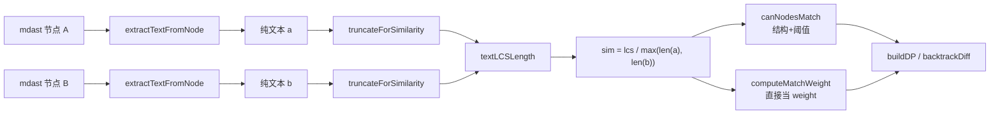

# MD-002. 块级文本相似度：从 AST 节点到 0~1 权重

| 属性 | 值 |
|------|-----|
| 难度 | Easy ~ Medium |
| 标签 | `字符串` `LCS` `归一化` `工程化优化` |
| 项目实现 | [`markdownDiff.ts`](../src/components/markdownDiff/markdownDiff.ts) — `extractTextFromNode` / `computeTextSimilarity` / `canNodesMatch` / `computeMatchWeight` |
| 上游算法 | [MD-001 带权 LCS 与对齐回溯](./weighted-maximum-common-subsequence.md) |

---

## 一、为什么需要这个？

[MD-001](./weighted-maximum-common-subsequence.md) 的加权 LCS 依赖两个外部函数：

```ts
canMatch(i, j): boolean          // 旧块 i 和新块 j 能不能配对？
weight(i, j): number ∈ [0, 1]    // 如果能配，配对得分多少？
```

`canMatch` / `weight` 的核心都来自一个数 —— **两个块的文本相似度**。本文回答：

1. 「文本」是怎么从 mdast 节点里**提**出来的？
2. 提出来的两段字符串，怎么算出 **0~1** 的相似度？
3. 这个相似度怎么变成 `canMatch` 的「能否配对」和 `weight` 的「加多少分」？
4. 长文本怎么不卡？大表/大段如何兜底？

---

## 二、整体链路



**一句话**：「**纯文本提取 → 长度归一化的 LCS 相似度 → canMatch 当门槛、当权重**」。

---

## 三、文本提取：`extractTextFromNode`

### 实现

```ts
function extractTextFromNode(node: MdastNode): string {
  if (!node) return ''
  // ① 叶子：直接取 value
  if (node.type === 'text' || node.type === 'inlineCode' || node.type === 'code') {
    return String(node.value ?? '')
  }
  // ② 容器：递归拼接所有子节点（无分隔符）
  if (Array.isArray(node.children)) {
    return (node.children as MdastNode[]).map(extractTextFromNode).join('')
  }
  return String(node.value ?? '')
}
```

### 三条规则

| 规则 | 行为 |
|------|------|
| **叶子节点取值** | `text`、`inlineCode`、`code` 三种节点的 `value` 直接返回 |
| **容器节点递归** | 有 `children` 就深度优先拼接每个子节点的结果 |
| **无分隔符拼接** | 子节点结果首尾相连，没有空格/换行 |

### 例子：段落

**Markdown**

```markdown
This is **important** information.
```

**mdast**

```
paragraph
├─ text("This is ")
├─ strong
│  └─ text("important")
└─ text(" information.")
```

**`extractTextFromNode` 输出**

```
"This is important information."
```

- `**` 没了（格式标签丢）
- 空格保留（`"This is "` + `"important"` + `" information."`）

### 例子：表格

**Markdown**

```markdown
| Name | Score |
|------|-------|
| Alice | 85 |
```

**输出**（拼接顺序按 AST 深度优先）

```
"NameScoreAlice85"
```

> 注意：单元格之间**没分隔符**。所以两张表头列顺序不同时，会被认为「不一样」——不过 `canNodesMatch` 对 table 类型会单独处理（允许列数不同的表格匹配），并不只靠这条字符串。

### 哪些信息**丢了**？

| 节点 | 丢失内容 |
|------|----------|
| `strong` / `emphasis` / `delete` | 格式标签（`**`、`*`、`~~`） |
| `link` | URL（只留 link text） |
| `image` | URL 和 alt 都丢（image 没有 children，且不命中叶子三类，会走 `node.value ?? ''` → `""`） |
| `heading` | 层级（`#` 个数） |
| `list` | 有序/无序、标记符号 |
| `code` | lang、meta，但 **value 保留**（即代码正文保留） |

### 与 `extractFormattedText` 的区别

代码里还有个表亲 `extractFormattedText`：

| 函数 | 用途 | 保留格式 | 输出示例 |
|------|------|----------|----------|
| `extractTextFromNode` | **块级相似度**（本文主角） | ❌ | `"This is important information."` |
| `extractFormattedText` | **行内文本 diff 渲染** | ✅ | `"This is **important** information."` |

后者会把 `strong` 还原成 `**...**`、`link` 还原成 `[text](url)`，让 `<del>`/`<ins>` 能体现「加粗变了」「URL 变了」。这两条路服务于**不同阶段**，互不冲突。

---

## 四、相似度计算：`computeTextSimilarity`

### 公式

$$
\text{similarity}(a, b) = \frac{\text{LCS}(a, b)}{\max(\text{len}(a), \text{len}(b))}
$$

代码：

```ts
function computeTextSimilarity(oldText, newText, config): number {
  // ① 边界：都空 → 1.0；一空一非空 → 0.0
  if (oldText.length === 0 && newText.length === 0) return 1.0
  if (oldText.length === 0 || newText.length === 0) return 0.0

  // ② 截断：避免超长文本拖慢 O(m·n)
  const maxLen = config?.maxSimilarityTextLength ?? MAX_SIMILARITY_TEXT_LENGTH  // 默认 2000
  const a = truncateForSimilarity(oldText, maxLen)
  const b = truncateForSimilarity(newText, maxLen)

  // ③ LCS 长度 / 较长者长度
  const lcsLen = textLCSLength(a, b)
  return lcsLen / Math.max(a.length, b.length)
}
```

### 为什么除以 `max(len(a), len(b))` 而不是 `min`？

| 选择 | 例子 `a="abc"`, `b="abcdefghij"` | 含义 |
|------|----------------------------------|------|
| `lcs / min` | `3 / 3 = 1.0` | 「a 完全是 b 的一部分」就 100% 相似 |
| `lcs / max`（本项目） | `3 / 10 = 0.30` | 「a 只占了 b 的 30%」 |

短文本「碰巧是」长文本的子串时，**用 min 会虚高**，把「插入一大段」错判为「轻微修改」。本项目用 `max`，更**保守**：长度差越大、相似度越低，保护「插入」不被误判为「修改」。

### LCS：`textLCSLength`

```ts
function textLCSLength(a, b): number {
  const m = a.length, n = b.length
  const dp: number[][] = Array.from({ length: m + 1 }, () => Array(n + 1).fill(0))
  for (let i = 1; i <= m; i++)
    for (let j = 1; j <= n; j++)
      dp[i][j] = a[i - 1] === b[j - 1]
        ? dp[i - 1][j - 1] + 1
        : Math.max(dp[i - 1][j], dp[i][j - 1])
  return dp[m][n]
}
```

这就是经典 [LeetCode 1143](https://leetcode.com/problems/longest-common-subsequence/) 的标准实现，**只返回长度**，不回溯。复杂度 `O(m·n)`。

> 注意：这里是**字符级 LCS**（每个 char 作为元素），与 MD-001 的「块级 LCS」是同一套模板的不同粒度。

### 例子

| a | b | LCS | max | similarity |
|---|---|-----|-----|------------|
| `"hello"` | `"hello"` | `5` | `5` | **1.0** |
| `"hello"` | `"hallo"` | `4` | `5` | **0.8** |
| `"First paragraph."` | `"Second paragraph inserted."` | `12`（`" paragraph "` 等） | `26` | **≈0.46** |
| `"hello"` | `"world"` | `1`（`"o"` 或 `"l"`） | `5` | **≈0.2** |
| `""` | `""` | — | — | **1.0**（约定） |
| `""` | `"abc"` | — | — | **0.0**（约定） |

---

## 五、性能：`truncateForSimilarity` 与 `MAX_SIMILARITY_TEXT_LENGTH`

### 问题

字符级 LCS 是 `O(m·n)`，在块级匹配里**会被反复调用**：

- `buildDP` 一遍：`m × n` 次 `canNodesMatch` + `computeMatchWeight`
- `backtrackDiff` 又调一遍 `canNodesMatch`

最差情况：50 个旧块 × 50 个新块 × 每块 5000 字符 → `50 × 50 × 5000² = 6.25 × 10¹⁰`，浏览器卡死。

### 解决

```ts
export const MAX_SIMILARITY_TEXT_LENGTH = 2000

function truncateForSimilarity(text, maxLen): string {
  if (text.length <= maxLen) return text
  return text.slice(0, maxLen)
}
```

每段文本**最多取前 2000 字符**参与相似度计算。代价是：

- **优点**：上限可控（`2000²` 一次 DP ≈ 4M 次操作，毫秒级）
- **缺点**：超长段落只看开头判断「像不像」，结尾的差异看不到

实测里，2000 字符已能覆盖绝大多数段落、代码块、表格的主要内容；真正会出问题的极端长文档，由 `maxSimilarityTextLength` 配置项暴露给上层调整。

---

## 六、相似度怎么用？两个出口

### 出口 1：`canNodesMatch` —— 当做「门槛」

```ts
function canNodesMatch(oldNode, newNode, threshold, autoMatchCodeLangs): boolean {
  // 类型不同：直接拒绝
  if (oldNode.type !== newNode.type) return false

  // 结构属性硬过滤（相似度看不到这些）
  switch (oldNode.type) {
    case 'heading': if (oldNode.depth !== newNode.depth) return false; break
    case 'code':    if (oldNode.lang !== newNode.lang) return false
                    if (autoMatchCodeLangs.has(oldNode.lang)) return true  // 1:1 短路
                    break
    case 'link':    if (oldNode.url !== newNode.url) return false; break
    case 'image':   if (oldNode.url !== newNode.url || oldNode.alt !== newNode.alt) return false; break
    case 'list':    if (oldNode.ordered !== newNode.ordered) return false; break
    case 'table':   break  // 允许列数不同
  }

  // 文本相似度过阈值才算匹配
  const oldText = extractTextFromNode(oldNode)
  const newText = extractTextFromNode(newNode)
  if (oldText.length === 0 && newText.length === 0) return true
  const effective = TYPE_SIMILARITY_THRESHOLDS[oldNode.type] ?? threshold
  return computeTextSimilarity(oldText, newText) >= effective
}
```

**两道闸**：

1. **结构闸**：类型/层级/URL/有序等关键属性硬比对（相似度看不到这些）
2. **相似度闸**：剩下的看文本是否够像

为什么要分两道？因为 `extractTextFromNode` 会把结构信息扔掉，比如：

- `# A` ↔ `## A`：文本都是 `"A"`，相似度 1.0，但作为标题它们**结构变了**
- `- A` ↔ `1. A`：同上
- `[A](url1)` ↔ `[A](url2)`：文本相同，但链接目标变了

如果只看相似度，这些场景会被错判为 equal，diff 标记全丢（这就是 [`scenario-fix-summary.md`](../docs/scenario-fix-summary.md) 里的问题一、问题七、问题八）。

### 阈值差异化：`TYPE_SIMILARITY_THRESHOLDS`

```ts
const DEFAULT_DIFF_CONFIG = { similarityThreshold: 0.35, ... }

const TYPE_SIMILARITY_THRESHOLDS = {
  heading: 0.55,    // 标题更敏感
  code: 0.5,
  table: 0.45,
  list: 0.45,
  blockquote: 0.4,
}
```

不同节点类型用**不同的阈值**：

- 段落默认 `0.35`（宽松）：允许较大改动还算同一段
- 标题 `0.55`（严格）：标题改动通常意味着小节重写，不轻易认作同一标题
- 代码块 `0.5`：代码改动也偏结构性

### 出口 2：`computeMatchWeight` —— 当做「权重」

```ts
function computeMatchWeight(oldNode, newNode, autoMatchCodeLangs): number {
  // 1:1 唯一 lang 的代码块：硬给 1.0
  if (oldNode.type === 'code' && autoMatchCodeLangs.has(oldNode.lang)) return 1.0

  const oldText = extractTextFromNode(oldNode)
  const newText = extractTextFromNode(newNode)
  if (oldText.length === 0 && newText.length === 0) return 1.0

  return computeTextSimilarity(oldText, newText)
}
```

**与 `canNodesMatch` 的差别**：

| 点 | `canNodesMatch` | `computeMatchWeight` |
|----|------------------|----------------------|
| 返回 | `boolean`（用阈值卡） | `number ∈ [0, 1]` |
| 用途 | 决定**能不能**配对 | 决定配对**值多少分** |
| 调用时机 | DP 填表前 / 回溯每一步 | 已通过 canMatch 后，DP 累加用 |
| 类型阈值差异 | 用 `TYPE_SIMILARITY_THRESHOLDS` | 不用，直接返相似度 |

只有 `canNodesMatch` 返回 `true` 时才会去算 `computeMatchWeight`，所以**算两遍相似度**？是的，但都被 `truncateForSimilarity` 限制在 `O(maxLen²)`，开销可控。后续若做性能优化，可以缓存。

---

## 七、综合用例

### 场景：中间插入一段（[`scenario-fix-summary.md` 问题二](../docs/scenario-fix-summary.md)）

**旧** `[P1: "First paragraph.", P2: "Third paragraph."]`
**新** `[P1: "First paragraph.", P2: "Second paragraph inserted.", P3: "Third paragraph."]`

#### 候选配对的相似度

| 配对 | a | b | LCS | max | sim |
|------|---|---|-----|-----|-----|
| 旧P1 ↔ 新P1 | `"First paragraph."` | `"First paragraph."` | 17 | 17 | **1.00** |
| 旧P1 ↔ 新P2 | `"First paragraph."` | `"Second paragraph inserted."` | ~12（` paragraph ` 等公共子序列） | 26 | **≈0.46** |
| 旧P2 ↔ 新P3 | `"Third paragraph."` | `"Third paragraph."` | 17 | 17 | **1.00** |

#### canNodesMatch（阈值 0.35）

全部 ≥ 0.35，都通过——三对都「可以」配对。

#### MD-001 加权 LCS 计分

- 路径 A（正确）：旧P1↔新P1(**1.0**) + 旧P2↔新P3(**1.0**) = **2.0**
- 路径 B（错误）：旧P1↔新P2(**0.46**) + 旧P2↔新P3(**1.0**) = **1.46**

DP 选 A，新P2 被识别为 `INSERT`，问题解决。

**结论**：相似度 `0.46` 既**没被 canNodesMatch 卡掉**（说明阈值 0.35 没把它当弃子），又**没在 DP 里赢**（说明加权机制起了作用）。这就是「门槛松、权重严」的设计哲学。

---

## 八、常见疑问

### Q1：为什么不用 Levenshtein / Jaccard / cosine？

| 算法 | 复杂度 | 实现成本 | 单调对齐感 |
|------|--------|----------|-------------|
| **LCS** | `O(m·n)` | 极简 | **强**（保留字符顺序） |
| Levenshtein | `O(m·n)` | 略复杂 | 强 |
| Jaccard（词袋） | `O(m+n)` | 中等 | 弱 |
| Cosine | `O(m+n)` + 词向量 | 高 | 弱 |

Markdown 段落天生有「字符顺序」语义，LCS 既快又能体现顺序，复杂度也能用 `truncate` 控住。

### Q2：相似度对**结构差异**真的看不到？

是的，且这是**有意为之**：

- 让 `canNodesMatch` 的 `switch` 专管结构（depth、url、ordered……）
- 让 `computeTextSimilarity` 专管内容
- **职责分离**，便于单独调整阈值/规则

### Q3：超长文本截断 2000 会不会误判？

截断的是**字符**，不是 token。对绝大多数 Markdown 块来说，前 2000 字符已能反映主旨。**最差情况**是「两个 5000 字段落，开头 2000 完全一样，但后面 3000 完全不同」，此时相似度会虚高 → 误配为 equal。这种极端场景在产品里少见；若必要可调高 `maxSimilarityTextLength`，代价是性能。

### Q4：为什么空文本对返回 1.0 而不是 0.0？

设计选择。两个空 `thematicBreak`（`---`）这类无文本节点，应该被视为「同一物」，所以返回 1.0；这与 `canNodesMatch` 里「无文本内容的节点，类型匹配即可」一致。

### Q5：相似度是对称的吗？

是的。`extractTextFromNode` 与 `textLCSLength` 都对称：`sim(a, b) === sim(b, a)`。

---

## 九、关键代码位置一览

| 函数 | 行号（约） | 作用 |
|------|-----------|------|
| `extractTextFromNode` | 1566 | 递归提取纯文本 |
| `extractFormattedText` | 1587 | 提取带格式文本（行内 diff 用） |
| `computeTextSimilarity` | 1638 | LCS / max → 0~1 |
| `truncateForSimilarity` | 1650 | 字符上限截断 |
| `textLCSLength` | 1662 | 经典 LCS（只算长度） |
| `canNodesMatch` | 1705 | 结构 + 阈值，返回 boolean |
| `computeMatchWeight` | 后续 | 返回 0~1 权重 |
| `MAX_SIMILARITY_TEXT_LENGTH` | `hunkPath.ts` | 默认 2000 字符 |
| `TYPE_SIMILARITY_THRESHOLDS` | `markdownDiff.ts` 顶部 | 差异化阈值 |

---

## 十、相关 LeetCode

| 题号 | 题目 | 关系 |
|------|------|------|
| [1143](https://leetcode.com/problems/longest-common-subsequence/) | 最长公共子序列 | `textLCSLength` 的原题 |
| [1312](https://leetcode.com/problems/minimum-insertion-steps-to-make-a-string-palindrome/) | 让字符串成回文的最少插入 | LCS 变种 |
| [583](https://leetcode.com/problems/delete-operation-for-two-strings/) | 使两串相同的最少删除 | LCS 推论：`m+n-2·LCS` |

---

## 十一、总结一句话

「**纯文本提取 → 长度归一化 LCS → 阈值卡门槛 + 权重定优劣**」——这套组合让块级 LCS 既能容忍局部小改、又不会把不相干的两段强行配对，是 [MD-001 加权 LCS](./weighted-maximum-common-subsequence.md) 能正确工作的底层燃料。
