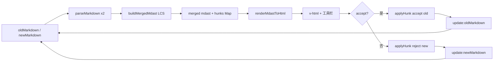

# Markdown Diff 优化任务清单

基于对 `src/components/markdownDiff/markdownDiff.ts` 与 `MarkdownDiff.vue` 的代码审查整理。按**影响面 × 实现成本 × 风险**从高到低排序。

> **状态**：以下任务已按里程碑实施（2026-05）；若需调整语义（如 accept 同时改两侧），见 README「接受 / 拒绝语义」。

---

## P0 — 高优先级（功能缺口 / 正确性 / 安全）

| # | 任务 | 状态 |
|---|------|------|
| 1 | **子级 diff 支持接受/拒绝** | ✅ 已注册子级 hunk + 表格/列表工具栏 |
| 2 | **`findNodeByPath` 与 apply 语义对齐** | ✅ `hunkPath.locateInAst` + `applyHunkToAst` |
| 3 | **不可信内容的 XSS 防护** | ✅ `rehype-sanitize` + README |
| 4 | **明确 accept/reject 的双侧同步策略** | ✅ `hunkResolve` 可配置 + 预设 + `@hunk-resolved` |

---

## P1 — 中高优先级（性能 / 可维护性）

| # | 任务 | 状态 |
|---|------|------|
| 5 | **AST 解析缓存** | ✅ `useMarkdownDiff` computed |
| 6 | **消除 App 与组件的重复计算** | ✅ App 复用 composable |
| 7 | **大文档渲染性能** | ✅ 截断 LCS + HTML 防抖 120ms |
| 8 | **透传 `DiffConfig`** | ✅ `diffConfig` prop |
| 9 | **合并/标注 hunk API** | ✅ `applyHunk` 统一入口 |

---

## P2 — 中优先级（diff 质量 / UX）

| # | 任务 | 状态 |
|---|------|------|
| 10 | **按节点类型差异化匹配策略** | ✅ `TYPE_SIMILARITY_THRESHOLDS` |
| 11 | **表头列映射增强** | ✅ fuzzy 表头匹配 |
| 12 | **inline 结构 diff 边界补全** | ✅ 双侧 inline 分支 |
| 13 | **移除脆弱的 text→paragraph 分支** | ✅ 改为文本回退 |
| 14 | **工具栏可访问性** | ✅ aria-label、focus-within、快捷键 A/R |
| 15 | **稳定 hunk ID** | ✅ `createStableHunkId` |

---

## P3 — 低优先级（代码整洁 / 体验抛光）

| # | 任务 | 状态 |
|---|------|------|
| 16 | **删除 `hunksRef` + `watch`** | ✅ 使用 composable `hunks` |
| 17 | **删除死代码 `advanceNewCursor`** | ✅ 已删除 |
| 18 | **补充单元/场景测试** | ✅ `markdownDiff.test.ts` |
| 19 | **类型收紧** | ✅ `MergedMdastRoot`、`types.ts` |
| 20 | **README / 使用文档** | ✅ README 更新 |

---

## 建议实施顺序（里程碑）

### 里程碑 1 — 正确性 + 安全

- [x] #3 XSS 防护
- [x] #4 accept/reject 双侧语义
- [x] #2 `findNodeByPath` 对齐

### 里程碑 2 — 核心体验

- [x] #1 子级 hunk + 嵌套 apply
- [x] #5 AST 解析缓存
- [x] #6 消除 App 重复计算

### 里程碑 3 — 质量调优

- [x] #8 透传 `DiffConfig`
- [x] #10 / #11 匹配策略与表头映射
- [x] #12 / #13 diff 算法边界

### 里程碑 4 — 抛光

- [x] #14 可访问性
- [x] #15 稳定 hunk ID
- [x] #16 ~ #20 清理与文档

---

## 数据流（参考）

