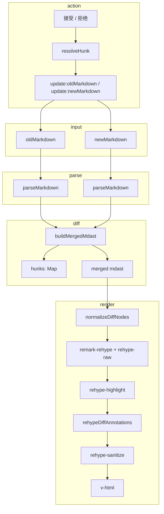

# MarkdownDiff 技术文档

> 本文档描述 `src/components/markdownDiff` 模块的整体架构、diff 算法、接受/拒绝语义、性能优化与演进方向。  
> 组件统一入口：[`src/components/markdownDiff/index.ts`](../src/components/markdownDiff/index.ts)  
> 场景问题修复记录：[`docs/scenario-fix-summary.md`](./scenario-fix-summary.md)

---

## 目录

1. [概述](#概述)
2. [架构与数据流](#架构与数据流)
3. [新旧文档比较](#新旧文档比较)
4. [接受与拒绝](#接受与拒绝)
5. [性能优化](#性能优化)
6. [渲染与安全](#渲染与安全)
7. [配置与 API](#配置与-api)
8. [当前能力与后续演进](#当前能力与后续演进)
9. [相关文件索引](#相关文件索引)

---

## 概述

**MarkdownDiff** 是基于 Vue 3 + [mdast](https://github.com/syntax-tree/mdast) 的 Markdown 双栏差异对比组件。核心思路是：

- 将 **old** / **new** 两份 Markdown 解析为 AST；
- 在 AST 上做**块级对齐**（加权 LCS）与**递归细粒度合并**（文本/行内/表格特例）；
- 生成带 `dataDiffId` / `dataDiffType` 的 **merged mdast** 与可交互的 **hunk 索引**；
- 经 unified/rehype 管线渲染为 HTML，支持对单个变更块**接受**或**拒绝**。

与纯文本 line-diff 相比，AST diff 能保留段落、标题、表格行、列表项等结构语义，并在块内再做词级或字符级 diff。

---

## 架构与数据流

### 模块分层

| 层级 | 文件 | 职责 |
|------|------|------|
| 入口 | `index.ts` | 导出组件、composable、工具函数、类型、Vue 插件 |
| UI | `MarkdownDiff.vue` | `v-html` 展示、点击/快捷键触发 accept/reject |
| 状态 | `useMarkdownDiff.ts` | 解析缓存、merged 计算、HTML 防抖渲染 |
| 核心算法 | `markdownDiff.ts` | parse/merge/render、LCS、mergeEqualNodes、rehype 插件 |
| hunk 应用 | `hunkPath.ts` | 路径定位、`applyHunkToAst`、稳定 hunk ID |
| 类型 | `types.ts` | `DiffHunk`、`DiffConfig`、`HunkResolveConfig` 等 |

### 端到端流程



### 三层 diff 粒度

| 粒度 | 作用 | 主要函数 |
|------|------|----------|
| 文档根 | 顶层块（段落、标题、代码块等）对齐 | `buildMergedMdast` → `mergeSubsequence` |
| 块级 | `insert` / `delete` / `equal`，equal 继续深入 | `buildMergedFromDiff` + `mergeEqualNodes` |
| 文本级 | 词级或字符级 `<del>` / `<ins>` | `mergeTextChildren` / `diffText` |

---

## 新旧文档比较

### 主流程

1. **`parseMarkdown`**：`remark-parse` + `remark-gfm` 得到 `Root` AST。
2. **`addKeyToNodes`**：为每个节点生成结构 key（`nodeKey`），用于 LCS。
3. **`mergeSubsequence`**：对旧/新子节点序列做**加权 LCS**，输出 `insert` / `delete` / `equal`。
4. **`buildMergedFromDiff`**：将 diff 序列转为 merged 根节点，注册顶层 `DiffHunk`。
5. **`mergeEqualNodes`**（递归）：对 equal 节点比较子树，产生 `modified` 或行内 diff，并注册子级 hunk。

```ts
// 简化调用链
const oldChildren = addKeyToNodes(oldAst.children)
const newChildren = addKeyToNodes(newAst.children)
const autoMatchCodeLangs = buildAutoMatchCodeLangs(oldAst.children, newAst.children)
const diffResult = mergeSubsequence(oldChildren, newChildren, config, autoMatchCodeLangs)
return buildMergedFromDiff(diffResult, config)
```

### 块级对齐：演进路径

#### 1. 结构 key（`nodeKey`）

`nodeKey` 编码节点类型与结构属性，**不把正文变化当作结构变化**：

| 节点类型 | key 附加信息 |
|----------|----------------|
| `heading` | `depth` |
| `list` | `ordered`（有序/无序） |
| `link` | `url` |
| `code` | `lang`、`meta` |
| `image` | `url`、`alt` |

用途：结构不同的节点（如 h1→h2、ul→ol）不应被 LCS 当作 equal。

#### 2. 模糊匹配（`canNodesMatch`）

类型相同且结构属性满足时，用**文本相似度**判断是否可匹配：

- 默认阈值：`similarityThreshold`（默认 `0.35`）；
- 部分类型更高阈值：`TYPE_SIMILARITY_THRESHOLDS`（heading、code、table、list 等）；
- **1:1 同语言代码块**（`buildAutoMatchCodeLangs`）：跳过相似度，直接匹配。

相似度计算：`extractTextFromNode` 提取纯文本 → 字符串 LCS 长度 / 较长文本长度。

#### 3. 加权 LCS（解决弱匹配抢占）

**问题**（场景 07）：等权 LCS 下，「第一段 ↔ 第二段」弱匹配与「第一段 ↔ 第一段」强匹配权重相同，回溯时误选弱匹配。

**解法**：

- `computeMatchWeight`：匹配权重 = 文本相似度（0~1）；
- `buildDP`：`dp[i][j] = max(dp[i-1][j-1] + weight, dp[i-1][j], dp[i][j-1])`；
- `backtrackDiff`：仅当 `dp[i][j] ≈ dp[i-1][j-1] + weights[i][j]` 时才走对角线（采纳匹配）。

#### 4. 领域特例（避免通用 LCS 失效）

| 场景 | 策略 | 说明 |
|------|------|------|
| `tableRow` 内 cell | **按列下标配对** | 不用 LCS；防止列数溢出导致 remark-rehype 截断 cell |
| 整张 `table` | **表头 fuzzy 列映射** | `computeColumnMapping` + `mergeTableRowWithMapping`；支持列增删、表头重命名 |
| 行内结构变化 | **`generateInlineStructureDiff`** | 如 `**x**` ↔ `*x*`、纯文本 ↔ 加粗；避免子节点 LCS 乱配 |
| 代码块文本 | **字符级 `diffChars`** | `normalizeCodeCharDiff` 调整换行/缩进边界，避免高亮错位 |

#### 5. mdast 与 HTML 类型名

mdast 节点类型与 HTML 标签名不同，混用会导致路径错误或标签丢失：

| mdast | 勿写成 |
|-------|--------|
| `emphasis` | `em` |
| `link` | `a` |

`WRAPPABLE_TAGS` / `renderInlineNodeAsHtml` 中的 `em`、`a` 指 **hast 层 HTML 标签**，无需修改。

### 合并结果与 hunk

- **merged mdast**：节点带 `data.hProperties.dataDiffId`、`dataDiffType`（`insert` / `delete` / `modified` / `unchanged`）。
- **`DiffHunk`**：可交互块元数据，含 `path`（新稿）、`oldPath`（旧稿）、`oldNode` / `newNode` 快照。
- **稳定 ID**：`createStableHunkId(path, diffType, node)`，便于 resolve 后重算 diff 时追踪同一逻辑位置。

### 典型难点与修复（摘要）

详见 [`scenario-fix-summary.md`](./scenario-fix-summary.md)。主要包括：

- 块级标签未进入 `WRAPPABLE_TAGS` → 无红绿样式；
- 加权 LCS、回溯偏好（先删后增）；
- 表格行/列表项：`DIRECT_ANNOTATE_TAGS`（`tr`、`li` 等不能包 `<div>`）；
- `<pre>` 从子 `<code>` 传播 diff 属性；
- 代码高亮与 diff 共存：normalize 阶段 lowlight 分段高亮 + `no-highlight`；
- 嵌套 inline：`renderInlineNodeTreeAsHtml`。

---

## 接受与拒绝

### 语义（默认 `classic`）

| 操作 | 用户意图 | 默认更新 |
|------|----------|----------|
| **接受** | 旧稿采纳此处变更 | `oldMarkdown`（`onAccept: 'old'`） |
| **拒绝** | 新稿回退到旧稿 | `newMarkdown`（`onReject: 'new'`） |

可通过 `diffConfig.hunkResolve` 配置：

| 预设 | onAccept | onReject |
|------|----------|----------|
| `classic`（默认） | `old` | `new` |
| `syncBoth` | `both` | `both` |
| `mirror` | `new` | `old` |

### 实现链路

1. **构建期**：`registerHunk` / `annotateWithRegisteredHunk` 写入 `hunks` Map。
2. **交互期**：`MarkdownDiff.vue` → `resolveAction(hunk, action)` → `resolveHunk`。
3. **应用期**：`applyHunkToBothSides` → `applyHunkToAst`（`locateInAst` + `spliceAtPath`）。
4. **回写**：`mdastToMarkdown` → `emit('update:oldMarkdown')` / `update:newMarkdown` / `hunk-resolved`。

### `applyHunkToAst` 行为矩阵

| diffType | accept + **old** 侧 | reject + **new** 侧 |
|----------|---------------------|----------------------|
| `insert` | 插入 `newNode` | 删除该节点 |
| `delete` | 删除该节点 | 插入 `oldNode` |
| `modified` | 替换为 `newNode` | 替换为 `oldNode` |

### 历史问题：接受无反应

早期仅在 `newAst` 上执行 accept，导致 `newMarkdown` 不变、diff 不消失。  
**修复**：accept 必须更新 **old** 侧（`oldPath` + `applyHunk(..., 'accept')`），并 `emit('update:oldMarkdown')`。

### 注意事项

- **嵌套 hunk**：`HunkBuildContext` 累加 `newPath` / `oldPath`；路径与子树结构必须一致。
- **序列化往返**：`mdastToMarkdown` 可能轻微改变空白/符号，属结构级合并而非逐字符保真。

---

## 性能优化

| 问题 | 原因 | 措施 |
|------|------|------|
| 大文档相似度计算慢 | 字符串 LCS 为 O(m×n) | `maxSimilarityTextLength`（默认 2000）截断 |
| 块级 LCS 慢 | 顶层子节点 O(n²) | 同上；极长文档仍为理论瓶颈 |
| 重复 parse/diff | 多处调用 | `useMarkdownDiff` 中 `computed` 缓存 AST 与 merged |
| 频繁重渲染 HTML | 完整 unified 管线 | `watch(merged.mdast)` + **120ms 防抖** + `shallowRef(html)` |

未实现：Web Worker 并行 diff、虚拟滚动、增量 diff。

---

## 渲染与安全

### 渲染管线顺序

```
normalizeDiffNodes
  → remark-rehype
  → rehype-raw
  → rehype-highlight
  → rehypeDiffAnnotations（包裹 diff-hunk、工具栏、表格/列表直接 class）
  → rehype-sanitize
  → rehype-stringify
```

### `rehypeDiffAnnotations` 要点

- **可包裹标签**（`WRAPPABLE_TAGS`）：`p`、`h1`~`h6`、`pre`、`table` 等 → `<div class="diff-hunk">` + 工具栏。
- **直接标注**（`DIRECT_ANNOTATE_TAGS`）：`tr`、`td`、`li` 等 → 仅加 CSS 类，避免破坏 HTML 表格/列表结构。
- **代码块**：先将子 `<code>` 的 diff 属性传播到 `<pre>`，再判断是否 wrap。

### 安全

- 使用 `v-html` 输出；集成 **`rehype-sanitize`**（`sanitizeSchema.ts`）。
- 不可信 Markdown 勿依赖任意 HTML；必要时收紧 schema 或关闭危险 HTML。

---

## 配置与 API

### `DiffConfig`

| 字段 | 默认 | 说明 |
|------|------|------|
| `similarityThreshold` | `0.35` | 块级 LCS 文本相似度阈值 |
| `headerSimilarityThreshold` | `0.85` | 表头 fuzzy 匹配（列重命名） |
| `maxSimilarityTextLength` | `2000` | 相似度计算最大字符数 |
| `hunkResolve` | `classic` | 接受/拒绝更新哪一侧 |

### 组件用法

```vue
<script setup lang="ts">
import { ref } from 'vue'
import { MarkdownDiff, HUNK_RESOLVE_PRESETS } from 'markdown-diff'

const oldMd = ref('# Hello')
const newMd = ref('# Hi')
</script>

<template>
  <MarkdownDiff
    v-model:old-markdown="oldMd"
    v-model:new-markdown="newMd"
    :diff-config="{
      similarityThreshold: 0.35,
      hunkResolve: HUNK_RESOLVE_PRESETS.classic,
    }"
    @hunk-resolved="(p) => console.log(p)"
  />
</template>
```

### Composable

```ts
import { useMarkdownDiff } from 'markdown-diff'

const { html, hunks, merged, resolveAction } = useMarkdownDiff(
  () => oldMarkdown.value,
  () => newMarkdown.value,
  { similarityThreshold: 0.35 }
)
```

### 核心导出函数

| 函数 | 用途 |
|------|------|
| `parseMarkdown` / `mdastToMarkdown` | AST ↔ Markdown |
| `buildMergedMdast` | 生成 merged AST + hunks |
| `renderMdastToHtml` | 渲染 HTML |
| `resolveHunk` | 接受/拒绝并返回应写回的 Markdown |
| `applyHunk` | 单侧 AST 应用 hunk |
| `diffText` | 独立文本 diff（词/字符） |

### 快捷键

聚焦 diff 容器内时：**A** 接受、**R** 拒绝（当前聚焦的 `[data-diff-id]` hunk）。

---

## 当前能力与后续演进

### 已具备（里程碑见 [`docs/TODO.md`](./TODO.md)）

- 块级加权 LCS + 表格列映射 + 行/列表项级 hunk；
- 行内/代码字符级 diff；接受/拒绝（可配置双侧）；
- 子级 hunk 工具栏；稳定 hunk ID；XSS sanitize；
- 单元测试 `markdownDiff.test.ts` + mock 场景。

### 后续可演进

| 方向 | 说明 |
|------|------|
| 超大文档 | Worker diff、虚拟列表、分段对比 |
| 对齐算法 | Tree-diff / histogram 降低 O(n²) 与误配 |
| 协作 | 三路合并、冲突标记、与 OT/CRDT 集成 |
| UX | 全部接受/拒绝、变更列表、上一条/下一条导航 |
| 格式保真 | 可配置 `mdastToMarkdown` 减少往返损耗 |
| 扩展语法 | 脚注、数学公式、Mermaid 等结构化 diff |

---

## 相关文件索引

| 路径 | 说明 |
|------|------|
| `src/components/markdownDiff/index.ts` | 统一导出入口 |
| `src/components/markdownDiff/markdownDiff.ts` | diff/merge/render 核心 |
| `src/components/markdownDiff/hunkPath.ts` | hunk 路径与应用 |
| `src/components/markdownDiff/types.ts` | 类型与预设 |
| `src/components/markdownDiff/useMarkdownDiff.ts` | Vue composable |
| `src/components/markdownDiff/MarkdownDiff.vue` | 展示组件 |
| `src/components/markdownDiff/markdownDiff.test.ts` | 单元测试 |
| `docs/scenario-fix-summary.md` | 场景问题与修复记录 |
| `docs/TODO.md` | 优化任务清单 |
| `algorithm/weighted-maximum-common-subsequence.md` | LeetCode 风格题解（加权 LCS + 回溯） |
| `algorithm/text-similarity.md` | 块级文本相似度（提取 + LCS + 阈值） |
| `README.md` | 使用说明 |

---

## 附录：一句话总结

**MarkdownDiff** 在 mdast 上用「块级加权 LCS + 表格/列表/inline 特例 + 文本 diff」生成带 hunk 的合并树，经 rehype 注入样式与工具栏；接受默认对齐旧稿、拒绝默认回退新稿；性能靠文本截断、computed 与 HTML 防抖；场景文档中的修复覆盖了结构对齐与 HTML 渲染两层的主要边界情况。
